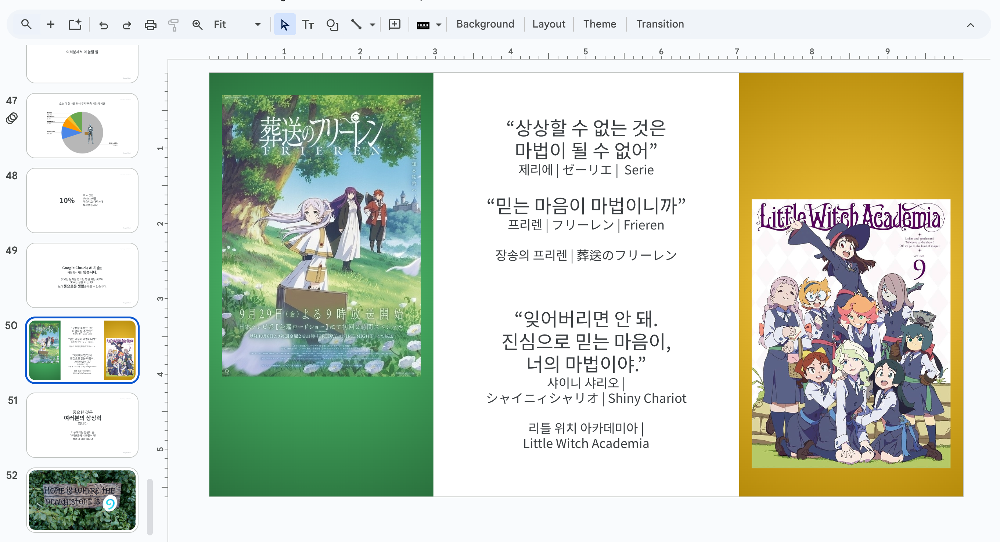

- Gaming on Google Cloud (2024년 4월) 발표를 위한 리허설 시작 전
  찍은 사진 한 장,  

    

  이 때 저는 정말 많이 신났습니다. Unity에 LLM을 호출하는 데모를 만들어서
  이런 저런 이유로 게임 내에서 소외된 서비스들을 부활시키는 것에 대해 이야기였습니다.
  LLM/인공지능이라는 것도 손에 잘 잡히지 않는다고 사람들이 말하던 시절, 
  '그래서 뭘 할 수 있는데?'라는 회의적인 반응이 주류를 이루전 시기에 
  '지금 우리가 다시 만들어 낼 수 있는 게임 속의 재미'를 이야기했습니다.
  돌이켜 보면, 대중 앞에서 발표한 그 많은 순간들 속에서 가장 가슴에 남는 시간이었습니다.

  그리고 발표 슬라이드들 중 한 장

  
