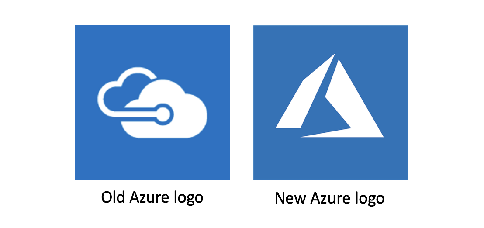

Microsoft Azure 혹은 클라우드 컴퓨팅에 대한 짧은 역사와 배경.

## Microsoft Azure

Azure는 Microsoft가 서비스 하고 있는 클라우드 컴퓨팅 관련 통합 브랜드이다. 

### 배경 

#### 간추린 역사

現 Microsoft Azure는 2010년 2월 1일 정식 서비스를 시작했다. 그 때 이름은, Windows Azure였다. 거창한 시작과는 다르게, 시장의 반응은 냉담하였고, Microsoft도 '거대한' 투자를 하겠다고 했지만, 적극적이지 않았다. 이 상황이 전환된 계기는, 現 Microsoft CEO, [Satya Nadella](https://en.wikipedia.org/wiki/Satya_Nadella)의 등장이라고 할 수 있다. Satya Nadella는 2014년 2월 4일 공식적으로 CEO로 취임하면서 Microsoft는 일대 대전환기를 맞는다. 

사실상, Microsoft는 Satya Nadella의 이전과 이후로 나누어 평가할 수 있으며, 지금까지 우리가 알고 있던 Microsoft는 [Steve Ballmer](https://en.wikipedia.org/wiki/Steve_Ballmer)의 퇴장과 함께, 혹은, Satya Nadella의 등장과 함께 사라졌다고 봐도 무관하다.

現 CEO 취임 두 달 남짓한, 2014년 3월 35일 Windows Azure는 Microsoft Azure로 재명명(再命名)되었다. 이 와 함께 Azure는 단순한 Windows VM 중심의 사업에서 현재의 업계를 선도하는 새로운 그리고 미래적 가치를 담게 되었다.

Microsoft Azure는 짧은 기간 급속 성장을 이루고 있으며, 현재 전세계 42개 [regions](https://azure.microsoft.com/en-us/regions/)를 보유하고 있다. 이는 경쟁사 비하여 2배에서 7배 많은 수이다. 

#### 표기

Azure는 Azure로 표기한다. 세상 모든 언어에서도 Azure로 표기한다. 따로 다른 언어로 번역하여 적지 아니하더라. Microsoft도 공식적으로는 세상 모든 언어권에서 그냥, Microsoft로 적는 것을 원칙으로 하고 있더라.

#### 발음
Azure는 /애-저:/로 발음한다고 한다. 하지만, 많은 사람들이 /애-저:/라고 발음하지 않더라. 이웃나라에서는 /애주-라/, 유럽쪽 어디에서는 /아주-라/ 그리고 어떤 사람은 애주르 또는 /아주-ㄹ/라고도 하더라. 아무튼, 의도하고 있는 발음은 /애-저:/라고 한다.

공료롭게, 우리나라에서 '애저'라고 하면, 돼지 猪자를 쓰는 '애저'가 있다. (태어나기 전의) 새끼 돼지를 지칭하는 단어인데, 요리와 음식에서 쓰이는 말로, Azure와는 이미지가 전혀 다른 동음이의어가 되겠다. 애저구이와 애저찜이 대표적인 요리이다.

#### URL
[azure.com](http://azure.com) 여기는 [azure.microsoft.com](http://azure.microsoft.com)으로 연결된다. 실제 제어하는 곳은 Azure Portal이라고 부르며, [portal.azure.com](http://portal.azure.com)이라는 주소를 가지고 있다.

#### 로고 

2017년 9월 25일 Microsoft Ignite 2017 행사 중에 Azure의 로고가 변경되었다는 것을 시중에 알렸다. 그리고 [Azure Manifesto도 YouTube를 통해 공개](https://youtu.be/05935OAqxJQ)하였는데, 이 두가지 사실을 모두 아는 사람은 드물다. Azure Manifesto는 업로드된 2017년 9월 25일부터 이 글을 적고 있는 2017년 11월 6일까지 7,902 회 조회되었다. 

